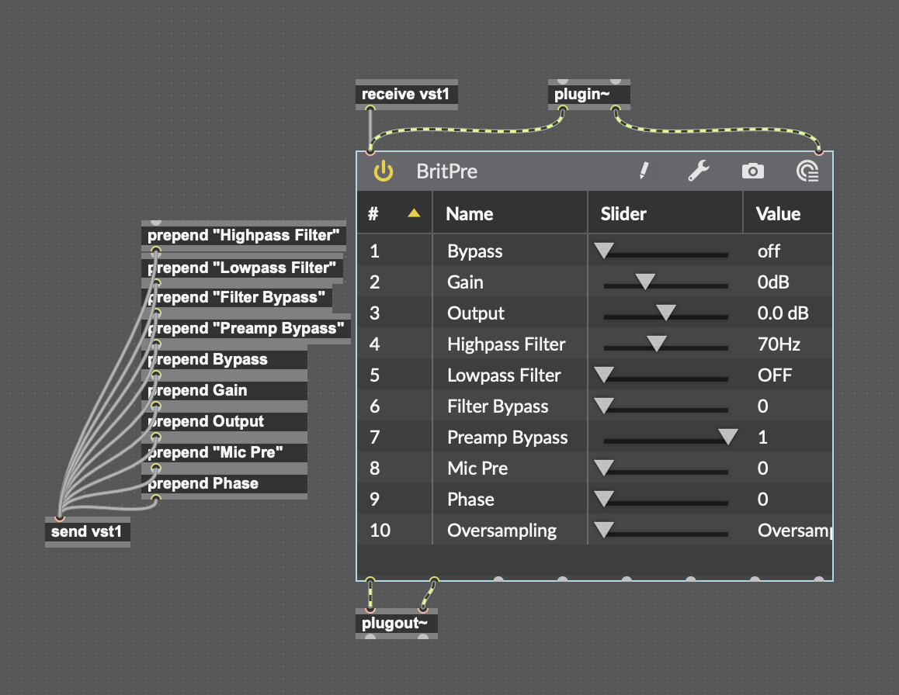

# AutoPrepender

AutoPrepender is a Script designed to automate the process of creating and connecting prepend objects in Max MSP. This tool is especially useful when creating VST wrappers for Ableton, where each parameter needs to be connected to a prepend object and the prepend object to a vst~ object - a process that can be quite tedious.

## Input File:
The script requires an .txt file as input containing the parameter names, each on a new Line. You can get the parameters from the vst~ object with your plugin loaded and use OCR to save them in a file. (Maybe there is a better way. I don't know.)

## How To Use:

MaxPrepender is a bash script that can be run on Mac, Windows and Linux.

Mac:
1. Download "Create Prepend from List.sh"
2. Open Terminal and navigate to the directory where the script is located using the cd command.
3. Run the script with the command ./Create\ Prepend\ from\ List.sh input.txt, where input.txt is your file with the parameter names.

Windows:
1. Download "Create Prepend from List.sh"
2. Install Git Bash if you haven't already and open it.
3. Navigate to the directory where the script is located using the cd command.
4. Run the script with the command ./Create Prepend from List.sh input.txt, where input.txt is your file with the parameter names.

The script will generate a JSON structure that you can paste into Max MSP. After pasting, you can select all prepend objects and distribute them vertically.

